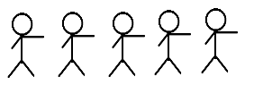
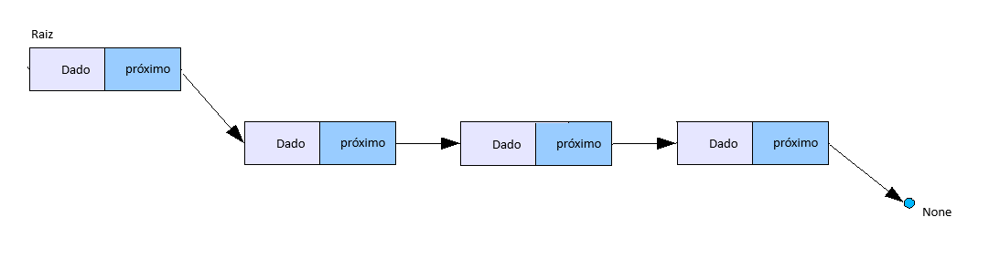

### Pre Requisitos:
- POO (Programação orientada a Objetos)
- Java


### Lista encadeada
Uma lista encadeada é uma estrutura de dados linear e dinamica que guarda n dados quaisquer (o dado pode ser um valor primitivo ou um objeto), também guarda a posição para o próximo elemento da lista, ou seja, em uma posição de memória é guardado o dado atual e também guardado o endereço de memória que o próximo dado está guardado (é guardado o dado e um ponteiro para o próximo dado) e sempre o último dado da lista não aponta para nada, ou seja o ponteiro dele é "null"

Exemplo: Imagine uma fila de pessoas, onde a primeira sabe onde a segunda pessoa está, mas não sabe onde as demais pessoas estão, mas a segunda sabe onde está a terceira, e por sua vez a terceira sabe onde está a quarta, até chegar na ultima pessoa da fila. Cada pessoa tem um nome (o dado armazenado) e tem a informação de onde está a próxima pessoa (o ponteiro), abaixo veja minhas incriveis habilidades  de desenho kkkk.



Para entender listas, primeiro é necessario definir o conceito de "nó", o "nó" seria uma pessoa dessa fila, ou seja o "nó" é um objeto que tem um objeto pessoa e tem um link (ou um ponteiro) para o próximo objeto do tipo "nó", podemos definir esse "nó" como uma classe que tem o dado ou objeto que queremos e também tem outro atributo do tipo "nó".

- Exemplo em Java do "nó"

    ```java

    public class No<T>{
        public T dado;
        public No<T> proximo;

        public No(T dado){
            this.dado = dado;
            this.proximo = null;
        }
    }
    // Usando generics para receber qualquer tipo de dado
    ```

- Exemplo em Java do "nó" para representar uma Pessoa 
    ```java

    public class No{
        public Pessoa pessoa;
        public No proximo;

        public No(Pessoa pessoa){
            this.pessoa = pessoa;
            this.proximo = null;
        }
    }
    ```
    Uma pessoa na fila que sabe a localização da próxima pessoa da fila.

- ###### Exemplo Visual comumente usado para representar lista encadeada


#### Métodos Implementados
- adicionar()
- deletarUltimo()
- deletarPrimeiro()


#### Implementações
* Lista encadeada: Na pasta `src`
* Testes na pasta `src/testes`


### Rodar os testes
- Clonar/baixar o projeto
- importar no eclipse IDE
- Entrar na Classe de teste e executar o arquivo    